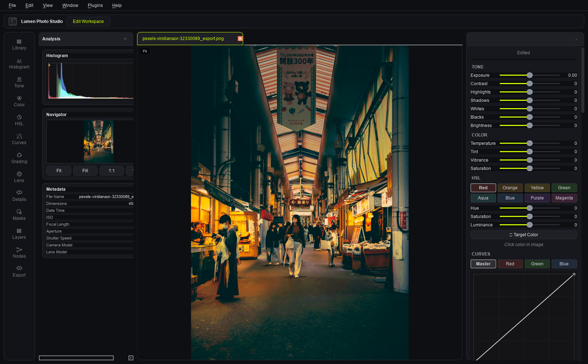
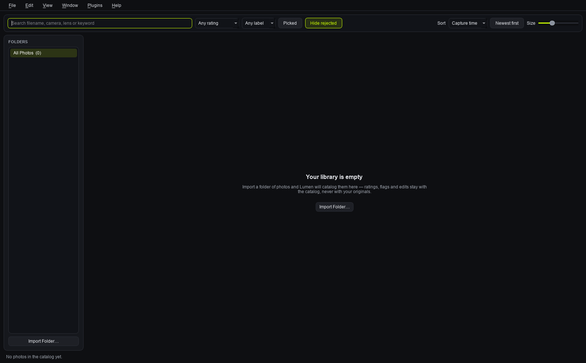
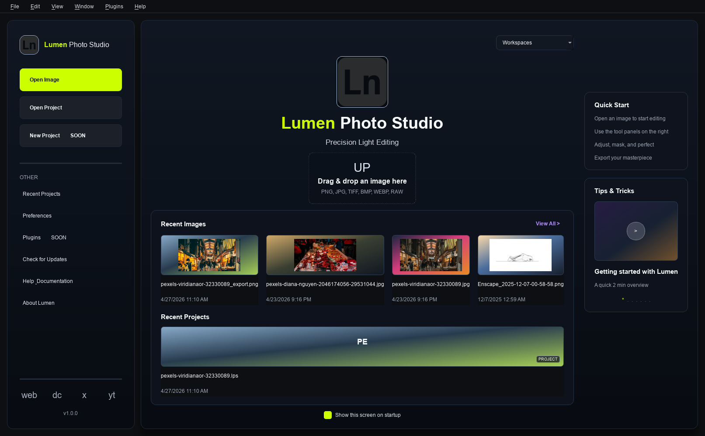

# Lumen Photo Studio

A free, open-source, non-destructive photo editor — a Lightroom
alternative, built in Qt 6 / C++20.

> **Project status: early / pre-alpha.** The Develop side of the app (RAW
> import, tone/color/curve editing, masking, presets, export) is real and
> under active development. There is **no photo library/catalog yet** — you
> open one image at a time. If you have a folder of 40,000 photos you need
> to organize, rate, and search, this project is not ready for that job
> yet. See [`docs/ROADMAP.md`](docs/ROADMAP.md) for what that gap looks
> like and what's planned to close it.

---

## Screenshots

### Develop

Linear-light editing with a live histogram, navigator, EXIF panel, and the full
tone / colour / HSL / curve stack.

### Library

The SQLite-backed catalog: folder tree, filter bar (rating, flag, colour label,
free-text search across filename, camera, lens and keywords) and sort.

### Welcome

Sample photograph from [Pexels](https://www.pexels.com/), used under the
Pexels licence. Screenshots are generated reproducibly with
`LumenPhotoStudio --screenshot <dir> --open <image>`, which renders each
workspace headlessly — no manual cropping, and they can be regenerated after
any UI change.

## What is this?

Lumen Photo Studio is an attempt at a genuinely open-source alternative to
Adobe Lightroom: a non-destructive RAW/photo editor with a physically
correct, linear-light color pipeline underneath it. Every edit is stored as
plain data (a `Look`) rather than baked into pixels, so nothing you do is
destructive and everything is re-editable later.

It is **not** a Lightroom clone in scope yet — most importantly, it has no
catalog module (see [Current status](#current-status) below). What it does
have is a develop/editing engine that we think is already worth building
on: correct sRGB↔linear conversion (not the common `pow(2.2)` shortcut),
a fused tone/curve LUT pipeline for real-time preview performance, and a
genuinely non-destructive editing model from the ground up. The deep
technical explanation of that pipeline lives in
[`docs/ARCHITECTURE.md`](docs/ARCHITECTURE.md).

## Current status

Legend: **Works** = real engine behavior backs the UI control. **Partial**
= the UI control and its data exist and save/load correctly, but the
engine does not yet act on it (moving the slider changes nothing in the
rendered image — this is called out honestly rather than hidden).
**Planned** = not started.

### Import & RAW

| Feature | Status | Notes |
|---|---|---|
| Standard image formats (JPEG, PNG, TIFF, etc.) | Works | Via Qt's image plugins. |
| RAW decode (CR2, CR3, NEF, ARW, DNG, RAF, ORF, RW2) | Works | Via an optional LibRaw dependency, detected at build time; RAW support is silently disabled if LibRaw isn't found. |
| RAW metadata (camera, lens, ISO, aperture, shutter, focal length, date) | Works | Read via LibRaw for RAW files, via Qt image-plugin text tags for others (coverage for the latter varies by format/platform). |
| RAW develop settings (white balance mode, highlight recovery, color space, camera profile) | Partial | The controls and data model exist; the RAW decoder does not yet apply them — it always uses camera white balance and an 8-bit sRGB decode regardless. |
| Full-bit-depth RAW pipeline | Planned | RAW is currently decoded to 8-bit before entering the (otherwise float32) pipeline, discarding most of a RAW file's real dynamic range. |
| Camera-specific color profiles (DCP/ICC) | Planned | |
| Lens-correction profiles (Lensfun) | Planned | |

### Develop

| Feature | Status | Notes |
|---|---|---|
| Exposure, contrast, highlights/shadows/whites/blacks, brightness | Works | Fused into a single LUT per render. |
| White balance, vibrance, saturation, 8-band HSL, RGB channel mixer | Works | |
| Master + per-channel tone curves | Works | |
| 3-way color grading (shadows/midtones/highlights color wheels + global tint) | Works | |
| `.cube` LUT support + film-profile presets | Works | 1D and 3D LUTs. Shaper+3D combined LUTs are not supported. Film profiles are currently just named LUTs, not full curve+response bundles. |
| Lift / Gamma / Gain / Offset (DaVinci-style) | Partial | UI and data round-trip; no rendering effect yet. |
| Filmic grading controls (filmic contrast, highlight rolloff, shadow lift, fade blacks, color separation) | Partial | Same as above — UI and data only. |
| Local adjustments: linear gradient, radial gradient, brush masks | Works | Brush painting is fully implemented (this was previously undocumented/understated). |
| Crop, rotate, flip, straighten | Works | |
| Perspective/keystone correction | Planned | |
| Lens vignetting correction | Works | |
| Lens distortion / chromatic-aberration correction | Partial | UI and data round-trip; the values are not yet applied to pixels. |
| Sharpening + luminance/color noise reduction | Works | Real unsharp-mask-style sharpening with edge masking, separate from the Clarity effect below. |
| Clarity, vignette, film grain effects | Works | Clarity is a midtone-contrast approximation, not a true unsharp-mask (that real behavior lives in Sharpening above). |
| Adjustment layers with blend modes (Multiply, Screen, Overlay, etc.) | Partial | Full layer-management UI (add/duplicate/delete/opacity/blend mode) and data model exist and persist correctly; layers are **not yet composited into the rendered image**. |
| Undo/redo, non-destructive project save/load, autosave | Works | |
| `.lxp` preset format (save/load/organize) | Works | Hardened JSON: schema-versioned, tolerant of missing/malformed fields. |
| Node-graph pipeline view | Works (read-only) | Visualizes the fixed pipeline stage order; it does not drive rendering and is not an editable node graph. |
| Plugin manifests (install/enable/browse) | Works | Manages plugin folders/manifests only — there is no runtime that executes plugin code yet. |
| Export (PNG / JPEG / TIFF) | Works | 8-bit only. |
| 16-bit export | Planned | |
| Color-managed export (Adobe RGB, ProPhoto RGB, soft-proofing) | Planned | Export currently assumes sRGB; other color-space options in the export dialog are placeholders. |
| GPU-accelerated rendering | Planned | Current pipeline is CPU, multi-threaded across scanlines. Fine for preview-resolution editing; will not scale to interactive full-resolution editing on large files. |

### Library / Catalog

| Feature | Status | Notes |
|---|---|---|
| Import workflow, grid/filmstrip browser | Planned | Does not exist. This is the single biggest gap versus Lightroom — see [`docs/ROADMAP.md`](docs/ROADMAP.md). |
| Ratings, flags, color labels | Planned | |
| Keywords, collections, search/filter | Planned | |
| XMP sidecar interop with Lightroom/darktable | Planned | |

For the full gap analysis, phased plan, and effort estimates, see
[`docs/ROADMAP.md`](docs/ROADMAP.md).

## Building

See [`docs/BUILDING.md`](docs/BUILDING.md) for build prerequisites and
platform-specific instructions (Windows, Linux, macOS). Short version:
CMake + Qt 6 (Core, Gui, Concurrent, Widgets); LibRaw is optional and only
needed for RAW file support.

Packaging/deployment details (windeployqt/macdeployqt, install layout) are
in [`docs/DEPLOYMENT.md`](docs/DEPLOYMENT.md).

## Contributing

Contributions are welcome — see [`CONTRIBUTING.md`](CONTRIBUTING.md) for
code style, the dev loop, and PR expectations. If you're looking for a
small, well-scoped first task, the roadmap has a
["good first issues"](docs/ROADMAP.md#4-good-first-issues) section with
concrete, verified-against-the-code starting points.

This project follows the [Contributor Covenant](CODE_OF_CONDUCT.md).

## Architecture

The engine's linear-light color pipeline, module map, and the `Look`/
`ImagePipeline` design are documented in
[`docs/ARCHITECTURE.md`](docs/ARCHITECTURE.md). If you're curious why the
color math matters (short version: `pow(2.2)` is wrong and Lumen doesn't
use it), that's where the detail lives.

## License

[GNU General Public License v3.0](LICENSE) — the same license used by
sibling open-source RAW editors darktable and RawTherapee.

GPL-3.0 was chosen deliberately by the project owner, weighed against MIT,
Apache-2.0 and MPL-2.0. The reasoning: copyleft keeps a well-resourced
competitor from taking the community's work closed, and it matches what
contributors in this niche already expect.

Compatibility notes:

- **Qt (LGPLv3)** — fine. Dynamic linking against the Qt shared libraries,
  which is what `windeployqt`/`macdeployqt` produce, satisfies LGPLv3's
  relink requirement regardless of this project's own license.
- **LibRaw** — dual-licensed LGPL-2.1 **or** CDDL-1.0. The FSF considers
  CDDL GPL-incompatible, so Lumen consumes LibRaw under the **LGPL-2.1**
  branch of that dual license. This is the same approach darktable and
  RawTherapee take. LibRaw is linked dynamically and optionally here
  (`find_library`, not vendored), which keeps the footprint clean.

Per-file source headers should use the template in
[`docs/LICENSE-HEADER.txt`](docs/LICENSE-HEADER.txt).
